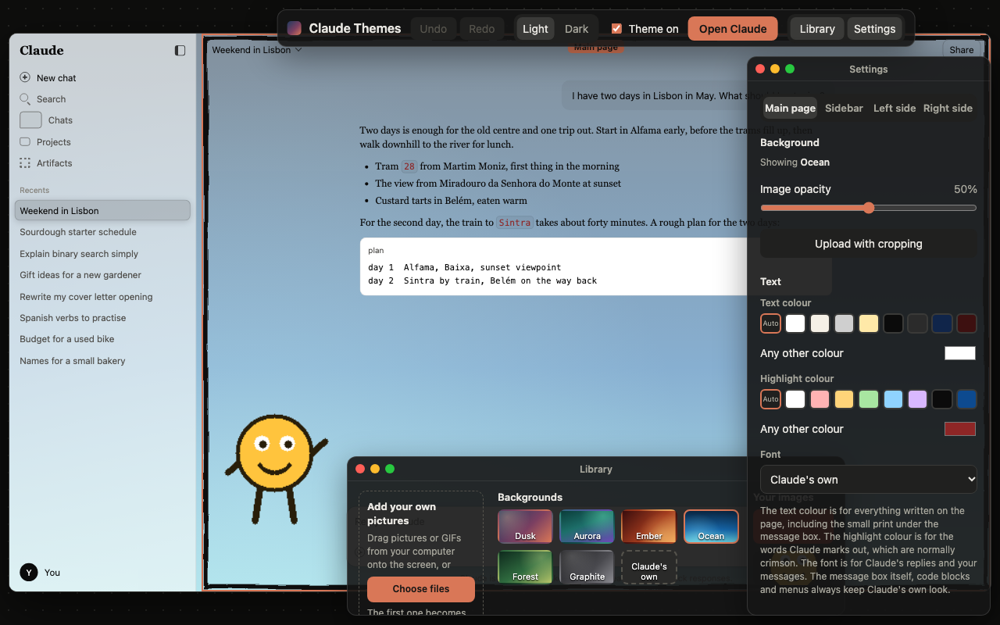
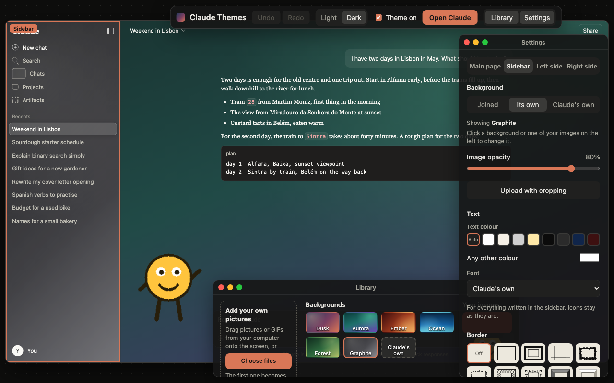

# Claude Themes

Backgrounds, borders, side pictures, text colour and fonts for [claude.ai](https://claude.ai),
set up in an editor that opens right on top of the Claude page.



Unofficial. Not made by, or affiliated with, Anthropic. It restyles the page in your own
browser only: your pictures and settings stay in Chrome on your computer and are never sent
anywhere. See [PRIVACY.md](PRIVACY.md).

## Install

It is not on the Chrome Web Store yet. Until it is:

1. Download this folder: the green **Code** button on GitHub, then **Download ZIP**, and
   unzip it. (Or `git clone` it.)
2. In Chrome, open `chrome://extensions`.
3. Turn on **Developer mode**, at the top right.
4. Click **Load unpacked** and choose the folder.
5. Open [claude.ai](https://claude.ai) and click the Claude Themes icon in the toolbar. If
   you do not see it, click the puzzle-piece icon and pin it.

After changing or updating the folder, press the reload arrow on the Claude Themes card on
`chrome://extensions`, then refresh claude.ai.

## Using it

The toolbar icon opens the editor over the Claude page. Its three windows (the bar, the
Library and the Settings) float like windows on a desktop: drag one by its title bar, drag
an edge to resize it, and use the three dots to close it, fold it away or put it back.

1. Click a part of the page: the main page, the sidebar, or the space on either side of
   the chat.
2. Click a picture in the Library to put it there, or drag one in from your computer.
3. Change it in the Settings window. Drag a picture on the page to move it.
4. **Done**, Esc, or the toolbar icon again closes the editor. Undo takes back any step.



## What it does

- Six built-in gradient presets
- Drop your own images onto the editor, or upload one with cropping: drag and zoom to
  choose the part that shows
- Every image you save is kept, so you can switch between them without uploading again
- A GIF can be a background too, for the page or the sidebar, and keeps moving. GIFs are
  saved whole, not cropped
- Image opacity slider, so a bright picture does not fight the text
- Sidebar opacity slider
- Borders: seven black ink frames (fineliner, double rule, draft lines, brush, sketch,
  hatching, Greek key), around the sidebar and the chat window separately or as one
  frame around everything
- Two pop-out frames, dark and pale, with sloping sides and a shadow, for a raised, 3D look
- Frames lie over the edge of the page. They never move or resize anything
- The main page and the sidebar are set up separately: each has its own background, text
  colour, font, frame and frame thickness
- The sidebar can share the main background, have a picture of its own with its own
  opacity, or stay exactly as Claude draws it
- A landscape background is stretched to the exact size of its space: the chat window,
  or the whole window when the sidebar is joined to it. The editor shows that size. An
  upright picture fills the page instead
- A Zoom slider for the background image and for the sidebar's picture, for keeping the
  picture's own shape: from the whole picture, with nothing cut off, through filling the
  space, up to four times that. The picture grows and shrinks around its middle and
  never slides. The crop tool on the upload page zooms out to the whole picture as well
- Drag to move: the background image on the page, the sidebar's picture on the sidebar,
  and a side picture anywhere in the chat window. A button puts each back
- The main page's theme is for chats. Claude's other pages (Projects, Artifacts,
  Scheduled, Customize and so on) are left exactly as Claude draws them; the sidebar keeps
  its own picture and text colour there
- Nothing on the page is blurred. Messages fade out as they reach the title bar
- Pictures or GIFs in the empty space on either side of the chat. Each side has its own
  size, height and opacity. They work with any background, including Claude's own. A picture
  bigger than the empty space carries on behind the chat, never on top of it
- Text colour and font for the chat, for backgrounds that make the normal text hard to
  read, and a separate colour for the words Claude marks out (normally crimson)
- Upload your own frame picture; its thickness is measured for you
- Works in light and dark mode
- Save the whole theme to a file, with its pictures, and load it again: as a backup, on
  another computer, or to give to someone else. **Reset everything** goes back to the start
- Undo and redo for every change

## What it leaves alone

- The message box, menus, code blocks and anything else you work with keep Claude's own
  look. Nothing is moved, resized or made to behave differently.
- Pages that are not chats (Projects, Artifacts, Scheduled, Customize) are shown exactly as
  Claude draws them.
- If Claude's site changes so that a chat is no longer built the way this version expects,
  the theme switches itself off on that page instead of showing it half-themed, and the
  editor says so. That is the sign to update.

## Limits

- Chrome, and browsers built on it, only. The Claude desktop app cannot be themed.
- It depends on how claude.ai is built, which Anthropic can change at any time.
- A stretched background, zoom and dragging are for saved images. The six built-in
  backgrounds are washes of colour.

## For developers

No build step and no dependencies: the folder is the extension.

```
node tests/static.mjs     # checks that need no browser (also run on every push)
node tests/run.mjs        # every browser test: prints PASS or FAIL for each suite
tools/package.sh          # makes dist/claude-themes-<version>.zip for the Chrome Web Store
```

The browser tests need a Mac with Chrome installed; see [tests/README.md](tests/README.md).
[CONTRIBUTING.md](CONTRIBUTING.md) says how changes are made, [CHANGELOG.md](CHANGELOG.md)
what changed in each version.

## Files

| File | What it does |
|---|---|
| `manifest.json` | Tells Chrome what the extension is and which pages it runs on |
| `settings.js` | The default settings and the lists of backgrounds, frames and fonts |
| `content.js` | Runs on claude.ai, reads the saved settings, shows the background, the sidebar's picture, the side pictures, frames and text style, and lays the editor over the page |
| `theme.css` | Styles the picture layers, makes the page see-through, draws the frames, recolours the text |
| `background.js` | Tells the Claude tab to open or close the editor when the toolbar icon is clicked |
| `editor.html`, `editor.js`, `editor.css` | The editor: the library of pictures, the parts you click and drop onto, and the settings of the selected part. `content.js` shows it in a see-through frame over the page |
| `preview.html`, `preview.css` | A stand-in for the Claude page, for when the editor has to open in a tab of its own (a Claude tab that has not been refreshed since the extension was reloaded). It uses claude.ai's class names, so `theme.css` and `content.js` style it exactly as they style the real page |
| `options.html`, `options.js`, `options.css` | The upload page, opened from the editor: crop an image for the screen or the sidebar and add it to your saved images |
| `frame-upload.js` | The upload page: read and save your own frame picture |
| `stickers.js` | The upload page: save a picture or GIF for beside the chat |
| `themes.js` | The editor: save the theme to a file, load one, reset everything, and the first-time note |
| `icons/` | The extension's icon, as a drawing (`icon.svg`) and at the four sizes Chrome uses |
| `tools/` | Scripts that make the icons, the screenshots and the zip for the Chrome Web Store |
| `docs/` | Screenshots, and what to put in the Chrome Web Store listing |
| `tests/` | Checks that run the extension's code in a separate, throwaway Chrome. See `tests/README.md` |

## Licence

MIT. See `LICENSE`.
